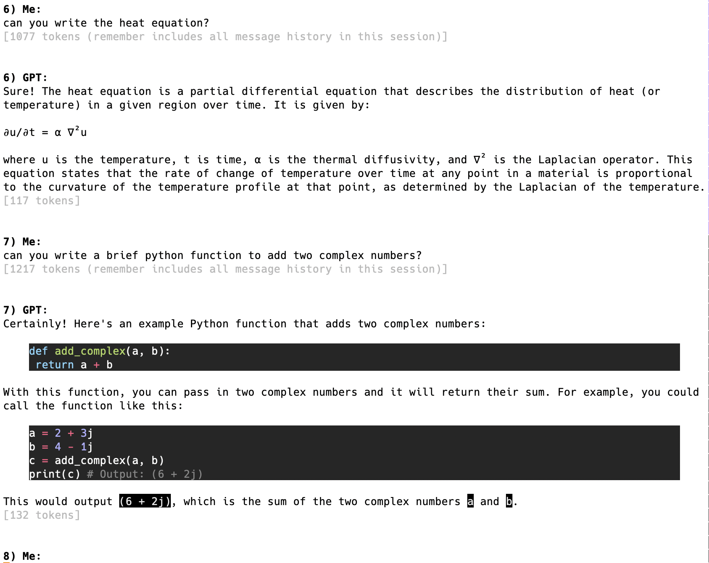

# openai_llm_tools
CLI tools to access the OpenAI LLM APIs, starting with a ChatGPT client.

OpenAI serves a ChatGPT web client on its webpage, but I really prefer to keep
certain things in the terminal, especially if I often copy/paste the results
into a neighboring tmux pane.  There's another popular CLI based ChatGPT client
out there called [Shell-GPT](https://pypi.org/project/shell-gpt) which has many
nice aspects but I made my CLIs more narrowly focused, with output formatting
that I prefer, and they're only about 100 lines in a single script so it's
easy for me to follow exactly what they're doing.  Plus of course this way I
learn about details in calling the API and prompt engineering for these models.

Be aware that any client outside of the one on OpenAI's website (which is free
for ChatGPT) requires an [API key](https://platform.openai.com/account/api-keys)
to access the API, and making calls to this API does 
[cost money](https://openai.com/pricing#language-models).
However, it's super cheap if just using it oneself for reference queries (e.g.
I generally just use it as a stand-in for Google/Wikipedia/StackOverflow),
as opposed to serving it out to zillions of other users to use in a web app.
Like in my initial two days of fairly heavy usage I racked up a whole $0.20;
after a few months of light-moderate usage since then, I'm now up to $0.50.

Two scripts so far, which both provide very similar-looking CLI experience for
ChatGPT:

`pygpt`: Basic command-line ChatGPT-API client in Bash, implementing packages
and tools like readline, syntax highlighting, prompt formatting, etc.  No command
line arguments yet; currently the few options are set inside the script, but I'll
add a click (or other) CLI soon that includes these.

`bashgpt`: *(deprecated)*:
Basic command-line ChatGPT-API client in Bash, implementing shell
tools like readline, syntax highlighting, prompt formatting, etc.  No command
line arguments; currently the few options are at the top of the bash script
(ideally I'd move them to command line args).  Simply run the ./bashgpt script
and then you're at the client prompt.  Contents auto-wrap to the width of the
current terminal window.
**Danger:** one of the main troubles in this bash-based client has trying to get
the escape-character handling stable over all the looping/reuse of messages -
escaping works in first few rounds but sometimes gets lost later which can
break the app functioning; usually it's a round or two after code snippets that
include characters like `*`, `\`, and `%`.  Note this danger includes a
security/privacy concern in that sometimes that `*` can cause the inadvertent
listing of files in your local directory (from wherever you run bashgpt) into
the prompt sent to the ChatGPT API.  After fussing with this enough I've moved
on to the python client, but leaving this bash one here for reference and in
case some better approaches come to light.

------

------

## Usage

1. Get an [API key](https://platform.openai.com/account/api-keys) (requires
creating an OpenAI account if you don't have one already) and put that key in
your shell environment, e.g. `export OPENAI_API_KEY=xyz123...`

2. Install dependencies and run the app:

    a. for Python-based `pygpt`:
     
    ..i.   create and enter a python environment, e.g. `python3 -m venv ~/.venv; source ~/.venv/bin/activate`
    
    ..ii.  install two python package dependencies: `pip install openai rich`
    
    ..iii. run the app: `python /path/to/openai_llm_tools/pygpt.py`
           The client's command line uses readline, so all the usual hot keys /
           editing work including a command history via Ctrl-P and Ctrl-N.
    
      iv.  quit via: `quit` or `exit` or `q` or `ctrl-D` or `ctrl-C`.
     
    b. for Bash-based `bashgpt`:
     
    ..i.   install `jq` and `rlwrap`, which are standard linux tools.
           (e.g. `sudo apt install jq` and `sudo apt install rlwrap`, or
           `brew install jq` and `brew install rlwrap`...)
    
    ..ii.  it's not required for bashgpt, but if you wish to have the syntax
           highlighting and other formatting in running the client, you'll need to
           install `rich-cli`, either via `brew install rich-cli` or
           `pip install rich-cli`.  If you choose to skip installing this, set
           `use_formatter=0` in the top of the bashgpt script.  (It's set to use it
           by default `=1`).  It can always be changed later.
    
    ..iii. run the app: `/path/to/openai_llm_tools/bashgpt`
           no arguments currently - and that'll start the client.  Ctrl-C to quit.
           The client's command line uses readline, so all the usual hot keys /
           editing work including a command history via Ctrl-P and Ctrl-N.

3. Know that OpenAI's GPT API is an immensely popular service right now and
that regardless of which client you use (one of these CLI ones, their website
one, or any other), expect that there are definitely slow times.  I've
experienced response wait times of up to 20sec and once-in-a-while responses
of "too busy right now".  But *usually* the responses are within a few seconds.
These waits/too-busy are not about the client apps but about the API service.

## Refs / more info

Model choices/explanations at:

  https://learn.microsoft.com/en-us/azure/cognitive-services/openai/concepts/models

More detailed usage instructions for these models in terms of crafting queries:

  https://learn.microsoft.com/en-us/azure/cognitive-services/openai/how-to/chatgpt?pivots=programming-language-chat-completions

Details about additional chatgpt parameters for tuning functionality:

  https://platform.openai.com/docs/api-reference/chat/create

